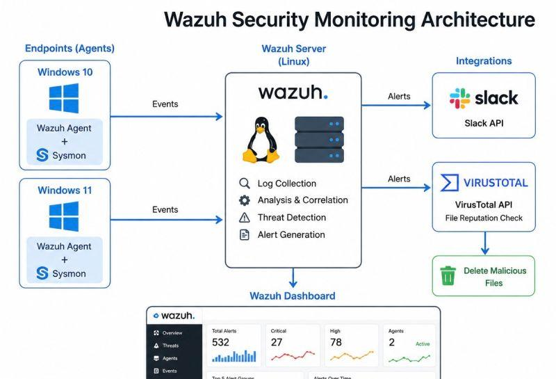

# Cyberion-ThreatShield
Cyberion ThreatShield can be built as a complete SOC Detection Engineering + Threat Hunting portfolio project

## 🏗️ Wazuh Security Monitoring Architecture

Cyberion ThreatShield uses Wazuh as the central security monitoring and detection platform. Windows endpoints generate security telemetry through Sysmon and the Wazuh Agent. The collected events are forwarded to the Wazuh server for log analysis, correlation, threat detection, alert generation, and investigation.

### Architecture Components

- **Windows 10/11** — Endpoint systems
- **Sysmon** — Detailed Windows security telemetry
- **Wazuh Agent** — Endpoint log collection
- **Wazuh Server** — Log analysis, correlation and detection
- **Wazuh Dashboard** — Alert monitoring and investigation
- **VirusTotal** — File/hash reputation analysis
- **Slack** — Security alert notifications
